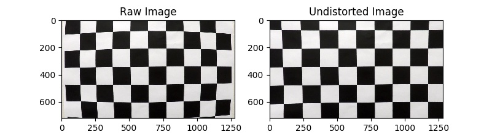
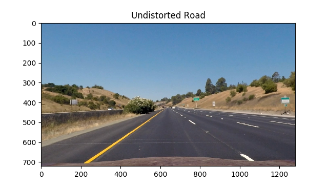
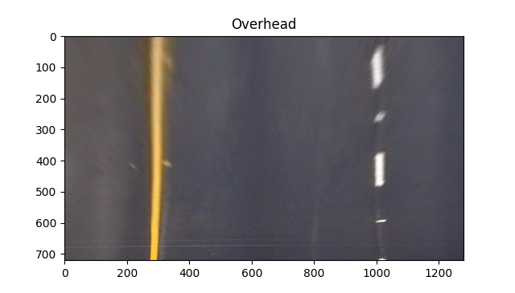
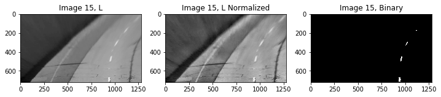
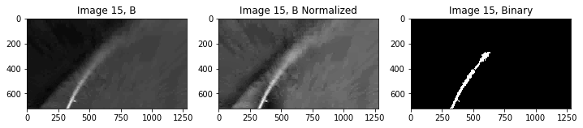
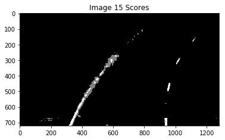
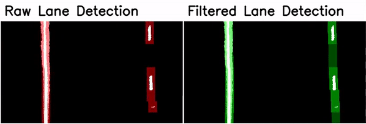
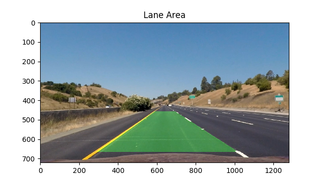

## Writeup Template

**Advanced Lane Finding Project**

The goals / steps of this project are the following:

* Compute the camera calibration matrix and distortion coefficients given a set of chessboard images.
* Apply a distortion correction to raw images.
* Use color transforms, gradients, etc., to create a thresholded binary image.
* Apply a perspective transform to rectify binary image ("birds-eye view").
* Detect lane pixels and fit to find the lane boundary.
* Determine the curvature of the lane and vehicle position with respect to center.
* Warp the detected lane boundaries back onto the original image.
* Output visual display of the lane boundaries and numerical estimation of lane curvature and vehicle position.

## [Rubric](https://review.udacity.com/#!/rubrics/571/view) Points

### Here I will consider the rubric points individually and describe how I addressed each point in my implementation.

---

### Writeup / README

#### 1. Provide a Writeup / README that includes all the rubric points and how you addressed each one.  You can submit your writeup as markdown or pdf.  [Here](https://github.com/udacity/CarND-Advanced-Lane-Lines/blob/master/writeup_template.md) is a template writeup for this project you can use as a guide and a starting point.

You're reading it!

### Camera Calibration

#### 1. Briefly state how you computed the camera matrix and distortion coefficients. Provide an example of a distortion corrected calibration image.

The code for this step can be found in the `DashboardCamera` class in `find_lanes.py`, which manages all image calibration, correction, and warping. ``DashboardCamera.calibrate()` handles calibration specifically. 

Calibrating a camera involves getting a bunch of pictures of a chessboard with your camera, using some OpenCV functions to find pixel locations of the corners on the chess board (image points) with `cv2.findChessboardCorners`, and then pairing them with the known real-world positions of those corners (object points). These paired points are then passed to `cv2.calibrateCamera()` to get back the camera matrix and distortion coefficients, and then pass that, with your image of choice, to `cv2.undistort()` to undistort.

I applied this distortion correction to the test image using the `cv2.undistort()` function and obtained this result:

### Pipeline (single images)

We start with an image of the road.

#### 1. Provide an example of a distortion-corrected image.

Next we apply image distortion correction. Since we already calibrated the camera, this is easily done by a call to `cv2.undistort(image, self.camera_matrix, self.distortion_coeffs, None, self.camera_matrix)` as I do in [`DashboardCamera.undistort()`](https://github.com/peter-moran/highway-lane-tracker/blob/5f27ba180b823fceb46e41f2a47f1888957c3471/find_lane.py#L109).

#### 2. Describe how (and identify where in your code) you performed a perspective transform and provide an example of a transformed image.

Once you have an undistorted image, making it appear as if it is from a different perspective is even easier. With `cv2.getPerspectiveTransform()`you can select four points in the image you would like to warp to new positions. In this case, I want to warp the lane lines so that they are parallel (at least on straight roads), rather than leaning inwards towards the vanishing point. Selecting points from a straight section of highway I defined a warp with `cv2.warpPerspective()` that would move the lanes so that the top and bottom of of the lines were aligned vertically. This transform can then be applied with `cv2.warpPerspective()`.

This is all performed by [`DashboardCamera.warp_to_overhead()`](https://github.com/peter-moran/highway-lane-tracker/blob/5f27ba180b823fceb46e41f2a47f1888957c3471/find_lane.py#L115) which utilizes the overhead transform set up in the class' constructor.

I chose the hardcode the source points and then chose destination points that moved them to be aligned vertically and at the top and bottom of the image.

|  Source   | Destination |
| :-------: | :---------: |
| 584, 458  |   295, 0    |
| 701, 458  |  701, 720   |
| 295, 665  |  295, 720   |
| 1022, 665 |   701, 0    |

#### 3. Describe how (and identify where in your code) you used color transforms, gradients or other methods to create a thresholded binary image.  Provide an example of a binary image result.

Once we have an overhead image, the next step in the pipeline is to select pixels that we think are on the lane line. I decided to do this by:

1. Converting the image to another color space.
2. Selecting a specific color channel from that color space.
3. Normalizing the image using [CLAHE](http://docs.opencv.org/3.1.0/d5/daf/tutorial_py_histogram_equalization.html) (Contrast Limited Adaptive Histogram Equalization) normalization (which is particularly helpful because it normalizes different segments of the image separately, ensuring that there is strong local contrast and correcting for shadows).
4. Creating a binary image of the lane pixels by only selecting for pixels above a certain intensity.

These steps are done once for each chose color channel, the results of which are added into a single image. I call this final image the “score” image, as the intensity is highest where the color channels agree on lane pixel locations. To tune these parameters, I created a Jupyter notebook [`threshold_tests.ipynb`](https://github.com/peter-moran/highway-lane-tracker/blob/master/experiments/threshold_tests.ipynb) that let me run the pixel scoring procedure on a series of test images.

After tuning, I chose to use the LAB B, HSV value, and HLS lightness channels as they seemed the best at finding either the yellow or white lane lines with as little noise as possible. 

The code for this can be found in [`LaneFinder.score_pixels()`](https://github.com/peter-moran/highway-lane-tracker/blob/5f27ba180b823fceb46e41f2a47f1888957c3471/find_lane.py#L235).

#### Window Search

Next, we need to measure the position of each point on the line and then pass it through a filter. We track these points using sliding windows, one for each point. For example, in the image below you can see that each lane has nine windows. The left image shows the measurements while the right shows the filtered positions that we will later curve fit.

To achieve this behavior as above, we locate a cluster of pixels that could be part of the lane line, reject that measurement if we think it is an outlier, and filter the measurement if it is not.

Specifically, for each of the nine windows along the lane line, starting at the bottom of the image, we:

1. Scan the window across the image (again keeping its y-position fixed) and find the x-position where that window covers the most pixels.
   - If the window does not find any signal in its search region, it is mark as undetected.
2. This x-axis position is then checked by a series of outlier detectors:
   - If the Kalman filter reports a very low log likelihood for this measurement, it is considered an outlier.
   - If the window contains less than 60% of the pixels in the search area, it is also considered an outlier.
3. If something was detected and the measurement is not an outlier, then we pass the x position through the Kalman filter for the current window and update its filtered position.

Each consecutive window is constrained to an x-axis search region centered on the filtered position of the previous window. This means that filtering not only improves the accuracy of the filtered windows, it also ensures that the raw windows are constrained to the right search region. As a result, the raw windows are actually less error prone than on a system without filtering, where errors at the bottom of the image could propagate to the windows at the top. At times, the search region is also truncated to prevent it from overlapping into the search region of the windows in the opposite lane, which prevents the lane detections from crossing over each other.

**This next part is really important**. When any window is undetected or considered an outlier, *its filtered position does not change*; it is frozen. This allows us to model how we expect the lane line to stay in the same position for a short amount of time even when we cannot find it or see it. However, if a window stays frozen for too long we drop it entirely and prevent it from being used in curve fitting. In all visualizations, the green windows are faded when frozen and disappear when they are dropped after being frozen too long. All of this information is tracked in the `Window` object.

The bulk of the code that performs these operations can be found in [`joint_sliding_window_update()`](https://github.com/peter-moran/highway-lane-tracker/blob/5f27ba180b823fceb46e41f2a47f1888957c3471/windows.py#L184) and [`Window.update()`](https://github.com/peter-moran/highway-lane-tracker/blob/5f27ba180b823fceb46e41f2a47f1888957c3471/windows.py#L91) in `windows.py`.

#### 4. Describe how (and identify where in your code) you identified lane-line pixels and fit their positions with a polynomial?

We now have a reliable filtered position of the points along the lane line in the form of the green filtered windows. We also know which points are unreliable and should not be used (i.e. the dropped windows).

So, all we do now is apply a polynomial fit along the filtered windows that have not been dropped.

Code for doing this can be found in the second half of the [`LaneFinder.find_lines()`](https://github.com/peter-moran/highway-lane-tracker/blob/5f27ba180b823fceb46e41f2a47f1888957c3471/find_lane.py#L166)function (lines 200-210), which makes calls to [`LaneFinder.fit_lanes()`](https://github.com/peter-moran/highway-lane-tracker/blob/5f27ba180b823fceb46e41f2a47f1888957c3471/find_lane.py#L272).

#### 5. Describe how (and identify where in your code) you calculated the radius of curvature of the lane and the position of the vehicle with respect to center.

The radius of curvature is found by [`LaneFinder.calc_curvature()`](https://github.com/peter-moran/highway-lane-tracker/blob/5f27ba180b823fceb46e41f2a47f1888957c3471/find_lane.py#L329), which takes a list of Windows along a lane, returns an estimated radius of curvature of the lane. This is done by mapping the x, y positions of the windows back to world space and then doing a new polynomial fit on those world space points. the fit parameters are then used to calculate curvature.

Finding position in the lane is then found in [lines 215-218](https://github.com/peter-moran/highway-lane-tracker/blob/5f27ba180b823fceb46e41f2a47f1888957c3471/find_lane.py#L215) simply by calculating the position of the lane at the bottom of the image, finding the distance of the center of the image between those points, and then multiplying that by the number of meters wide we expect the lane to be.

#### 6. Provide an example image of your result plotted back down onto the road such that the lane area is identified clearly.

Having located the line and the points that describe the curve fit, I can warp selected lane back to a dashboard view with [`DahsboardCamera.warp_to_dashboard()`](https://github.com/peter-moran/highway-lane-tracker/blob/5f27ba180b823fceb46e41f2a47f1888957c3471/find_lane.py#L123). The selected lane area looks like this:

---

### Pipeline (video)

#### 1. Provide a link to your final video output.  Your pipeline should perform reasonably well on the entire project video (wobbly lines are ok but no catastrophic failures that would cause the car to drive off the road!).

Here's a [link to my video result](https://www.youtube.com/watch?v=xIOZcZ6eihM).

and the [challenge video](https://youtu.be/DXlEB6k4rvs).

---

### Discussion

#### 1. Briefly discuss any problems / issues you faced in your implementation of this project.  Where will your pipeline likely fail?  What could you do to make it more robust?

My approach was all about experimentation. I tried a lot of different things, from RANSAC to trying to fit lines globally so that they are parallel, and more. My ultimate solution here relies on some really robust outlier detection and filtering. It enabled me to keep a very stable fix on the lane lines.

One problem I still have is dealing with strong shadows and contrast and losing sight of lane pixels. In the future, I think I would use a neural network to determine what parts of the image contain lane pixels. The cleaner and more accurate I can get this image, the better the rest of the system will perform.